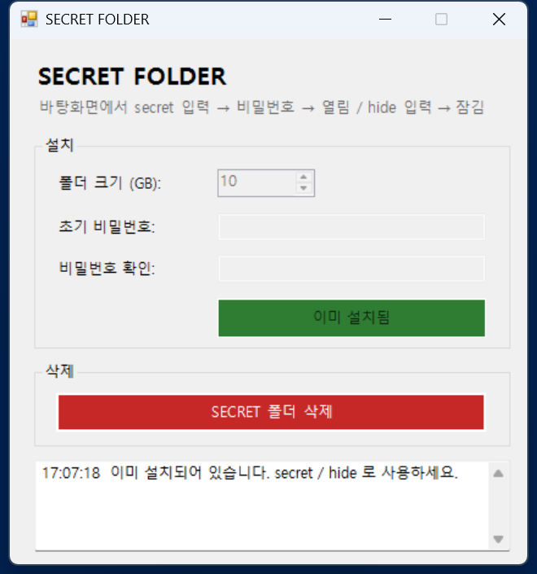

# SECRET FOLDER

바탕화면에서 **`secret`** 이라고 입력하면 나타나고, **`hide`** 라고 입력하면 사라지는 개인용 암호화 폴더입니다.
폴더 안의 파일은 [VeraCrypt](https://veracrypt.io/) 로 **AES 암호화**되어, 비밀번호 없이는 열 수 없습니다.

---

## ✨ 주요 기능

- **숨김** — 평소에는 바탕화면에 아무것도 보이지 않습니다.
- **키워드로 열기/닫기** — 바탕화면에서 `secret` 입력 → 아이콘 등장 → 더블클릭 → 비밀번호 입력 → 열림. `hide` 입력 → 잠금 + 아이콘 제거. (대소문자 구분 없음)
- **암호화** — 내용은 AES(SHA-512)로 암호화됩니다. 파일을 통째로 복사해 가도 비밀번호 없이는 못 엽니다.
- **입력 잠금** — 비밀번호를 3번 틀리면 5분간 입력이 잠깁니다.
- **부팅 시 자동 잠금** — 컴퓨터를 켜면 항상 잠긴 상태로 시작합니다.
- **비밀번호 변경** — 바탕화면에서 `changepw` 입력.
- **OneDrive와 분리** — 금고 파일은 OneDrive가 동기화하지 않는 위치(`사용자\.secretvault`)에 저장됩니다.

---

## 🚀 설치 방법 (원클릭)

1. 이 저장소를 내려받습니다. (초록색 **Code → Download ZIP** 후 압축 해제)
2. **`SecretFolder-Setup.bat`** 을 더블클릭합니다.
3. 창이 열리면 **폴더 크기(GB)** 와 **초기 비밀번호** 를 정하고 **[원클릭 설치]** 를 누릅니다.
   - 필요한 프로그램(AutoHotkey, VeraCrypt)을 자동으로 내려받아 설치합니다.
   - VeraCrypt 설치 중 **관리자 권한(UAC) 창**이 한 번 뜹니다. 허용해 주세요.
4. 설치가 끝나면 바탕화면에서 바로 `secret` 을 입력해 사용할 수 있습니다.

> 백신(예: Avast)이 자동화 스크립트를 의심해 경고할 수 있습니다. 이 경우 내용을 확인하고 예외로 허용해 주세요. (원리는 아래 문서 참고)

---

## 🖱️ 사용법

| 바탕화면에서 입력 | 동작 |
|---|---|
| `secret` | SECRET 아이콘이 나타납니다. 더블클릭 → 비밀번호 입력 → 폴더가 열립니다. |
| `hide` | 폴더를 잠그고 아이콘을 제거합니다. |
| `changepw` | 비밀번호를 변경합니다. (현재 → 새 비밀번호 2번 입력) |

> 반드시 **바탕화면 빈 곳을 한 번 클릭**한 뒤 입력하세요. 다른 창이 켜져 있으면 반응하지 않습니다.

---

## 🗑️ 삭제 방법

`SecretFolder-Setup.bat` 을 다시 실행하고 **[SECRET 폴더 삭제]** 를 누릅니다.

- 폴더가 **비어 있으면** → *정말로 SECRET폴더를 삭제하시겠습니까?* 확인 후 삭제됩니다.
- 폴더에 **파일이 남아 있으면** → *SECRET폴더에 파일이 남아있습니다. 폴더를 비우고 다시 시도해주세요.* 라고 안내하고 삭제하지 않습니다.

---

## 💻 요구 사항

- Windows 10 / 11
- 설치 시 인터넷 연결 (AutoHotkey, VeraCrypt 다운로드)
- 금고 크기만큼의 디스크 여유 공간

## 🔒 보안 유의사항

- **비밀번호를 잊으면 복구할 수 없습니다.** 반드시 따로 안전하게 적어 두세요.
- 짧은 비밀번호(4자리 등)는 파일을 복사해 간 공격자가 대입으로 뚫을 수 있습니다. **8자 이상**을 권장합니다.
- 이 도구는 "다른 사람이 우연히 보는 것"을 막아 줍니다. 국가·기업 수준의 공격을 가정한 도구는 아닙니다.
- **흔적 줄이기 (선택):** [`tools/Harden-Traces.ps1`](tools/Harden-Traces.ps1) 를 실행하면
  최근 항목·클립보드 기록을 꺼서 금고 밖에 남는 흔적을 줄입니다.
  `-Thumbnails` 를 붙이면 썸네일까지 끄지만, 이는 **컴퓨터 전체**의 미리보기를 아이콘으로 바꾸니 주의하세요.
  되돌리려면 `-Undo`. 흔적을 완전히 덮는 근본책은 디스크 전체 암호화(BitLocker)입니다.

---

> **폴더의 사용방법이나 비밀번호 변경 방법은 제작자의 깃허브 프로젝트를 참고해주세요.**

더 자세한 설명은 [`SECRET FOLDER.md`](SECRET%20FOLDER.md) 를 읽어 보세요.

---

## 📄 라이선스

[MIT License](LICENSE) — Copyright (c) 2026 KDU
